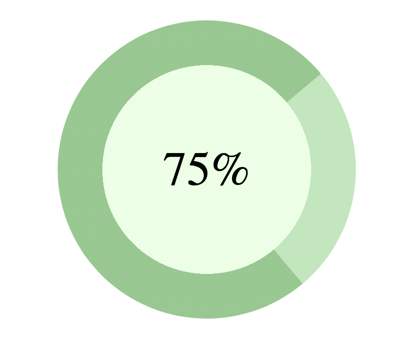

# Адаптивная вёрстка блоков сайтов, которую я сделал на своём учебном аккаунте, который был удалён после окончания обучения.

Свой итоговый код залил сюда, в основной аккаунт, для портфолио.

## 1 Блок
Резиновая батарейка

## 2 Блок
Индикатор

## 3 Блок
Диаграмма

## 4 Блок
Прогноз погоды

## 5 Блок
Кнопка "Комментировать"

## 6 Блок
Прогресс-бар шариками

## 7 Блок
Выезжающий блок обратной связи 

## 8 Блок
Вёрстка грид-элементов

